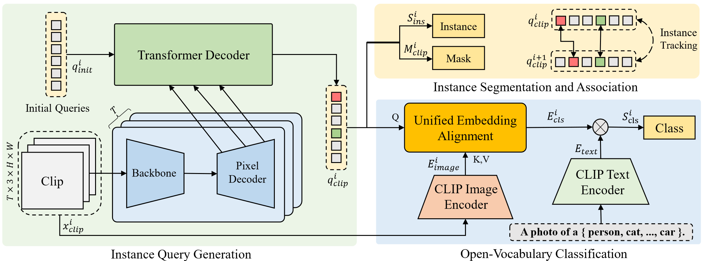

# Unified Embedding Alignment for Open-Vocabulary Video Instance Segmentation (ECCV 2024)

[Hao Fang](https://fanghaook.github.io/), 
Peng Wu, 
[Yawei Li](https://scholar.google.com.hk/citations?user=IFLsTGsAAAAJ), 
[Xinxin Zhang](https://scholar.google.cz/citations?user=rPv44PoAAAAJ), 
[Xiankai Lu](https://scholar.google.com.hk/citations?user=QS5V5b8AAAAJ)

[[`paper`]()] [[`BibTeX`](#CitingOVFormer)]

<div align="center">
  
</div><br/>

## Installation

See [installation instructions](INSTALL.md).

## Data Preparation
See [Preparing Datasets for OVFormer](./datasets/README.md).

##  Getting Started
We firstly train the OVFormer model on LVIS dataset:
```bash
python train_net.py --num-gpus 4 \
  --config-file configs/lvis/ovformer_R50_bs8.yaml
```
To evaluate model's zero-shot generalization performance on VIS Datasets, use
```bash
python train_net_video.py \
  --config-file configs/youtubevis_2019/ovformer_R50_bs8.yaml \
  --eval-only MODEL.WEIGHTS models/ovformer_r50_lvis.pth
```
YTVIS19/21 requires splitting the results.json into base and novel categories by [Tool](./tools/ytvis_json.py), 
OVIS directly packages and uploads to the specified server, BURST needs to run ```mAP.py```.
You are expected to get results like this:

|  Model   | Backbone | YTVIS19 | YTVIS21 | OVIS | BURST |  weights  |
|:--------:|:--------:|:-------:|:-------:|:----:|:-----:|:---------:| 
| OVFormer |   R-50   |  34.8   |  29.8   | 15.1 |  6.8  | [model](https://drive.google.com/file/d/1-tMcjp8xIYr9E5r5JYOESGajXtMAs33y/view?usp=sharing) |
| OVFormer |  Swin-B  |  44.3   |  37.6   | 21.3 |  7.6  | [model](https://drive.google.com/file/d/102qxZlu05yXILfghhrwjxv-tL3MlcYu7/view?usp=sharing) |

Then, we video-based train the OVFormer model on LV-VIS dataset:
```bash
python train_net_lvvis.py --num-gpus 4 \
  --config-file configs/lvvis/video_ovformer_R50_bs8.yaml
```
To evaluate a model's performance on LV-VIS dataset, use
```bash
python train_net_lvvis.py \
  --config-file configs/lvvis/video_ovformer_R50_bs8.yaml \
  --eval-only MODEL.WEIGHTS models/ovformer_r50_lvvis.pth
```
Run ```mAP.py```, you are expected to get results like this:

|     Model      | Backbone | LVVIS val | LVVIS test |  weights  |
|:--------------:|:--------:|:---------:|:----------:|:---------:| 
| OVFormer |   R-50   |   21.9    |    15.2    | [model](https://drive.google.com/file/d/1-zfEwdglPeVHzlc5Ky_HJlZtMgGXAy1S/view?usp=sharing) |
| OVFormer |  Swin-B  |   24.7    |    19.5    | [model](https://drive.google.com/file/d/107BNsu9eTr5e70B4oj28jgHKBjYTWNWp/view?usp=sharing) |

## <a name="CitingOVFormer"></a>Citing OVFormer
```BibTeX
@inproceedings{fang2024unified,
  title={Unified Embedding Alignment for Open-Vocabulary Video Instance Segmentation},
  author={Hao, Fang and Peng, Wu and Yawei, Li and Xinxin, Zhang and Xiankai, Lu},
  booktitle={ECCV},
  year={2024},
}
```

## Acknowledgement

This repo is based on [detectron2](https://github.com/facebookresearch/detectron2), 
[Mask2Former](https://github.com/facebookresearch/Mask2Former),
and [LVVIS](https://github.com/haochenheheda/LVVIS). Thanks for their great work!
